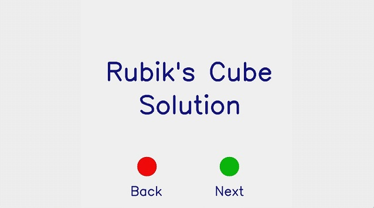
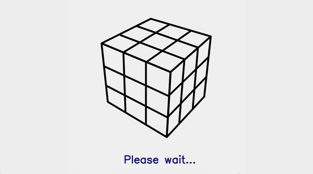
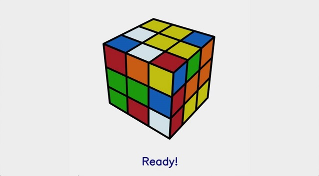
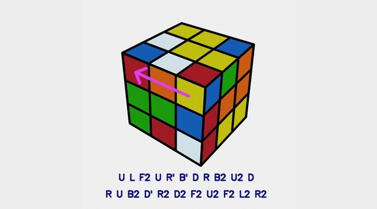
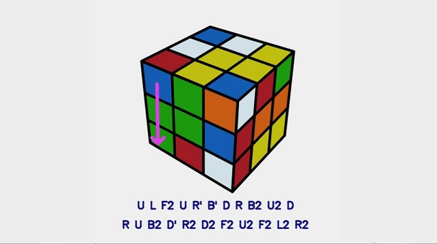
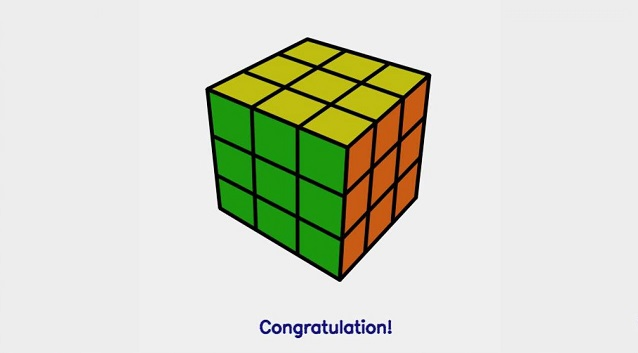

# Rubik's cube color classification with MobileNetV2 on Raspberry Pi

**This is my school project and also my first project to train a deep learning model. As a beginner, I just want to share how I trained the model to help other beginners like me. And I am not sure whether my method is considered good but it works well with my own dataset. So, if you get stuck with a similar application, you may give it a try. Any comments or suggestions are welcome.*

## Introduction
My goal is to train many models, each one can detect a single block color on the Rubik's cube, then with the prediction results, I give it to the rubik_solver module (link from [here](https://pypi.org/project/rubik-solver/)) to get a near optimal solution, and then show it to the screen so that any user can solve the cube within 26 moves. All they have to do is just click the Next button, take 2 images, and wait for the result. The problem is split into two parts, first is how to train the model and second is how to build an auto-running app on Raspberry Pi.  

  

  

**It takes about 1 seconds for predicting an image (step 1 to step 2)*  

## Dataset
[Training](https://drive.google.com/file/d/1wu1Zga3awv6pgdmGr6NDR4-DKXxzwamr/view?usp=sharing), [Validation](https://drive.google.com/file/d/1gzIa1JyBIEVxRf4sHn2CRQTp2M8CjzbN/view?usp=sharing) and [Testing](https://drive.google.com/file/d/1-0V9G07sqnaycZeYzkh3njxrEkhWmYL2/view?usp=sharing) data are 10000, 2000, 1800 pictures each. Most pictures are taken from PiCamera and some are from my phone. My definition of Rubik's cube front view is the White center at Up, Red center at Front and Blue center at Right, the back view is oppsite diagonally, which you can see from the picture above. Because the views are fixed, the amount of front and back pictures are the same and no other view is taken. And for the same reason, the number of models needed is 24 (not including the centers color). 

Pictures from different classes have different backgrounds and objects. And different angles, brightnesses, positions,... are applied while taking pictures. Moreover, the training data are augmented (see code below), all is for reducing overfitting.  
## Build and train the model
  [Python training code on Colab notebook](https://colab.research.google.com/drive/15tp3d3jr1LQ9MB58lhzv8CFywI9VQeos?usp=sharing)  
 

  

  
  
<h5 align="center">*The files in Colab main directory</h1>  
  
I trained the models using Google Colab Pro because the free version is not enough RAM for training (I know there is a technique which says not to train all the data at the same time, but I want to make things simple). I use the MobileNetV2 pre-trained model because of its small memory cost, then connect it to a Dropout layer and a Dense layer. Hyperparameters are fine-tuned to achieve best accuracy. The special thing is my method of training, and here are the steps:  
&nbsp;&nbsp;&nbsp;&nbsp;&nbsp;&nbsp;1. Only train the Dense layer (as many resources on the Internet recommend to, but most of them have no further step). Then when it starts to overfit (no improvement on val_accuracy after 3 epochs), stop the training process (automatically).  
&nbsp;&nbsp;&nbsp;&nbsp;&nbsp;&nbsp;2. Let the Dense layer untrainable, then train the MobileNetV2 until overfitting happens (like the first step).  
&nbsp;&nbsp;&nbsp;&nbsp;&nbsp;&nbsp;3. Train all layers.  
  After doing these three steps, I usually get an accuracy of above 98% on testing data.  
  
## Things to do on Raspberry Pi 

&nbsp;&nbsp;&nbsp;&nbsp;&nbsp;&nbsp;1. Install Tensorflow and OpenCV (which I learned from [here](https://www.youtube.com/watch?v=QLZWQlg-Pk0&list=PLlD0XVjVhLaKWQxzuwQgQlkgimoNhCoHw))  
&nbsp;&nbsp;&nbsp;&nbsp;&nbsp;&nbsp;2. Download the trained models (.h5 file)  
&nbsp;&nbsp;&nbsp;&nbsp;&nbsp;&nbsp;3. Write Python code to take images by button, preprocess the images, then predict one by one  
&nbsp;&nbsp;&nbsp;&nbsp;&nbsp;&nbsp;4. Translate the results to rubik_solver requires format  
&nbsp;&nbsp;&nbsp;&nbsp;&nbsp;&nbsp;5. Build the GUI (I do this almost by using OpenCV)  

  

<h5 align="center">*The hardware I used</h1>

## Results  
Below are the screenshots from RaspberryPi after power-on and warming for about 8 minutes  
  

  
  
  
  
  
  
  
  
  
  
  

